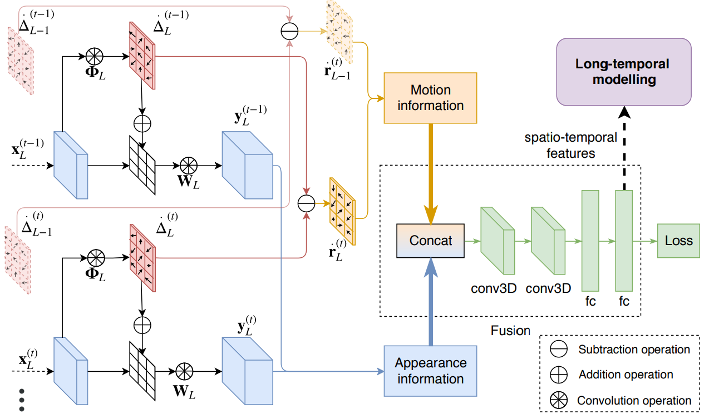
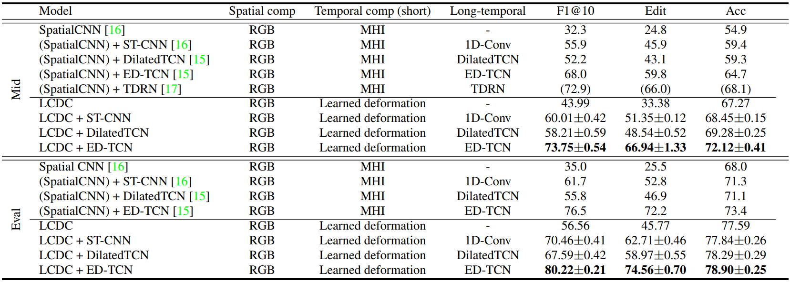
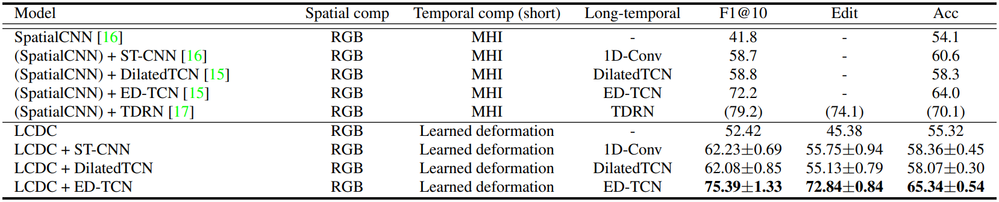
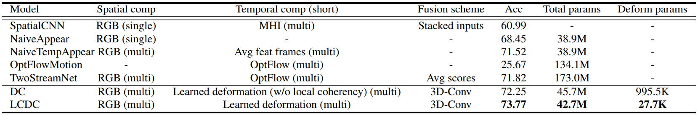

# Learning Motion in Feature Space

## About



This is the official repository for the paper *"Learning Motion in Feature Space: Locally-Consistent Deformable Convolution Networks for Fine-Grained Action Detection"* in ICCV 2019.

**Links**

- Paper: [arXiv](https://arxiv.org/abs/1811.08815)
- Project page: [link](https://knmac.github.io/projects/lcdc)

**Experimental results:**

- 50 Salads dataset: 
- GTEA dataset: 
- Ablation study: 


## Before running

Everything must be run from the root directory, *e.g.*
```bash
./scripts/50_salads/build_tfrecords_train.sh
```

To view the usage of python code, please use the help feature, *e.g.*
```bash
python ./src/trainer.py --help
```

Please consider copying and modifying the scripts in `scripts/` directory for other use cases.

## Installation

### Option 1: Docker

A docker for this project is available at: [link](https://cloud.docker.com/u/knmac/repository/docker/knmac/mrderf).

### Option 2: Manual install

It is recommended to create a separate virtual environment for this project.

**Dependencies**

Pip packages (can be installed using `pip install -r requirements.txt`):
```markdown
tensorflow-gpu==1.3.0
matplotlib
opencv-python
pyyaml
progressbar2
cython
easydict
scikit-image
scikit-learn
```

Other requirements:
```markdown
python3
ffmpeg
gcc4.9
cuda8.0
cudnn6.0
```
(The code may work with `gcc5`, but it has not been fully tested.)

**Setup TF\_Deformable\_Net:**

Clone TF\_Deformable\_Net
```bash
git clone https://github.com/Zardinality/TF_Deformable_Net $TF_DEFORMABLE_NET
```
where `$TF_DEFORMABLE_NET` is the target directory.

Add `$TF_DEFORMABLE_NET` to your environment (*e.g.* `.bashrc`), *e.g.*
```bash
export PYTHONPATH=$PYTHONPATH:$TF_DEFORMABLE_NET
```

Continue installing the framework by following the instruction on the original Zardinality's repository [TF\_Deformable\_Net](https://github.com/Zardinality/TF_Deformable_Net).

**Extra:**

In case the installation does not work, please replace with the files inside `./extra/TF_Deformable_Net/`. Remember to backup before overwriting.


## Weights and features

**Pretrained models** (for initialization)
==TODO==

**Trained weights**
==TODO==

**Extracted features** (for TCN)
==TODO==

## Usage

### Step 1: Download data

This section shows you how to set up dataset, using 50 Salads dataset as an example. Other datasets should follow a similar routine. 

Create `data/` directory, then download 50 Salads dataset and link it in `data/`, *e.g.*
```bash
ln -s [/path/to/salads/dataset] ./data/50_salads_dataset
```

Copy extra contents from `./extra/50_salads_dataset/` to `./data/50_salads_dataset/`.

**Credits:** The `labels` and `splits` are originally from Colin Lea's repository [TemporalConvolutionalNetworks](https://github.com/colincsl/TemporalConvolutionalNetworks).

You should have something similar to this:
```
data/
└── 50_Salads_dataset/
    ├── rgb/
    ├── labels/
    ├── splits/
    └── timestamps/
```

### Step 2: Extract frames and segment activities

Extract the frames and segment in fine-grained level. Modify the script accordingly.
```bash
./scripts/50_salads/prepare_data_50salads.sh
```

### Step 3: Create tfrecords

Prepare tfrecord files. Modify the script accordingly.
```bash
./scripts/50_salads/build_tfrecords_train.sh
```

### Step 4: Train models

Modify the training scripts accordingly before running. All training and testing scripts require GPU ID as an input argument, *e.g.*
```bash
./scripts/50_salads/resnet_motionconstraint/train_nomotion_g0.sh $GPU_ID
```

Results are stored in `logs/` directory. You can use TensorBoard to visualize training and testing processes, *e.g.*
```bash
tensorboard --logdir [path/to/log/dir] --port [your/choice/of/port]
```

Further details of how to use TensorBoard are available at this [link](https://www.tensorflow.org/programmers_guide/summaries_and_tensorboard).


### Step 5: Validate/test models

It is recommmended to run the testing script in parallel with the training script, using a different GPU. The default configuration will go through the checkpoints you have generated and wait for new checkpoints coming. Press `Ctrl+C` to stop the testing process. You can customize the number of checkpoints or which checkpoints to run by switching to other testing mode. Please inspect the help of `tester_fd.py` for more information.

```bash
./scripts/50_salads/resnet_motionconstraint/test_nomotion_g0.sh $GPU_ID
```

## Other tools and usage

### Extract features

Please change the output dir and other parameters accordingly.

```bash
./scripts/50_salads/resnet_motionconstraint/extract_feat_nomotion_g0.sh $GPU_ID
```

==TODO==

## Citation

If you are interested in using this project, please cite our paper as
```latex
@inproceedings{Mac_2019_ICCV,
    author    = {Khoi{-}Nguyen C. Mac and
                 Dhiraj Joshi and
                 Raymond A. Yeh and
                 Jinjun Xiong and
                 Rog{\'{e}}rio Schmidt Feris and
                 Minh N. Do},
    title     = {Learning Motion in Feature Space: Locally-Consistent Deformable Convolution Networks for Fine-Grained Action Detection},
    booktitle = {The IEEE International Conference on Computer Vision (ICCV)},
    month     = {Oct},
    year      = {2019}
}
```

